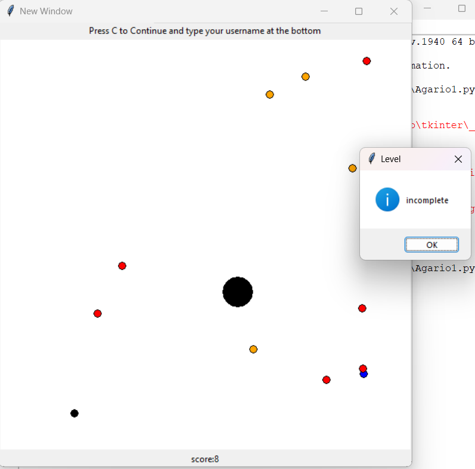
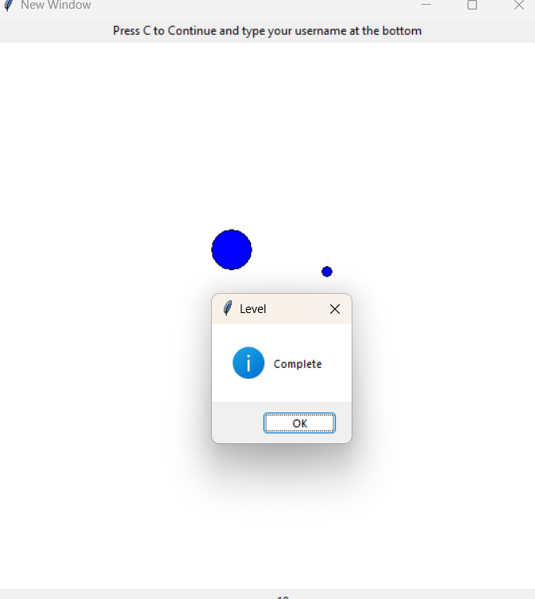
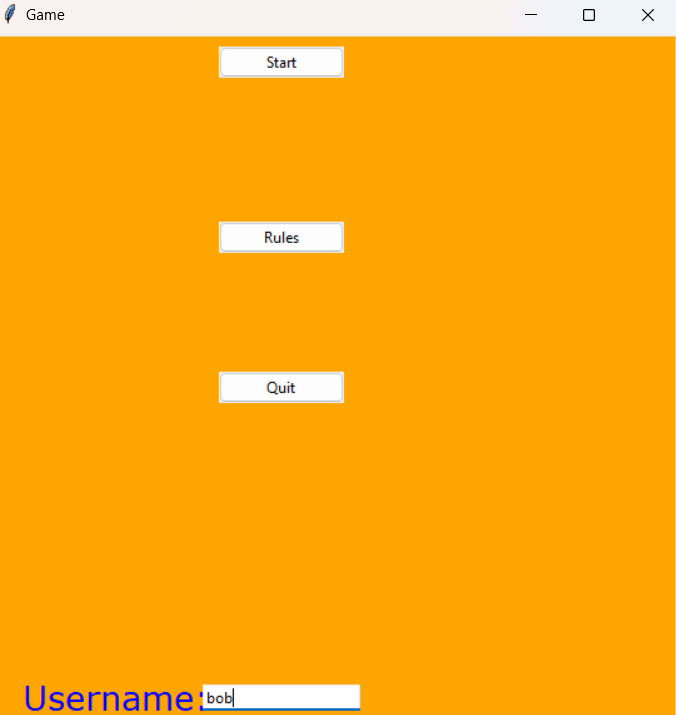

# Agario

## Game Overview

Agario is a simple game where you control a cell and aim to grow by consuming smaller cells. This game is implemented using Python and utilizes the tkinter library for the graphical interface.

## Screenshots

### Rules

### Incomplete Level

### Complete Level

### Homepage

## Prerequisites

To run Agario, you need to have Python installed. Ensure you have Python 3.x. You can download it from [python.org](https://www.python.org/).

Additionally, you will need to install the required Python libraries. You can install them using pip. For example: Tkinter. 
Run pip install python-tk in your terminal.

## Credits
Nathan Robel
